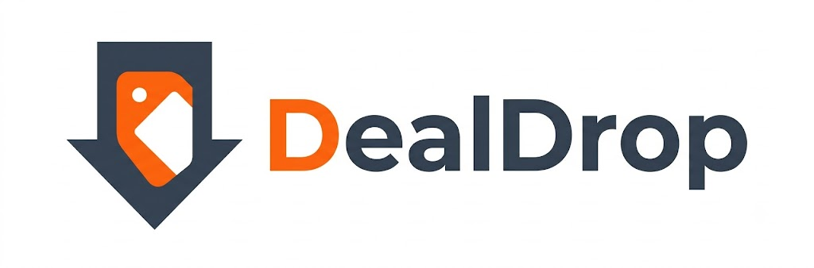

# 🛒 DealDrop

DealDrop is an intelligent product price tracker that ensures you never miss a price drop on your favorite e-commerce items. Simply paste a product URL, and DealDrop will continuously monitor its price, visually chart its history, and instantly email you when the price drops!



🔗 **Live Demo:** [https://deal-dropper.vercel.app](https://deal-dropper.vercel.app)

---

## ✨ Key Features

- **Instant Price Scraping:** Leverages Firecrawl AI to instantly extract product names, current prices, currencies, and images from almost any e-commerce URL.
- **Automated Daily Monitoring:** A Supabase pg_cron job runs every day to fetch the latest prices across all tracked products.
- **Price Drop Alerts:** Sends you a beautifully formatted email alert (via Resend) the moment a tracked product drops in price.
- **Historical Price Charts:** View interactive charts for each product to track price trends over time.
- **Authentication & Security:** Secure Google OAuth authentication and database Row Level Security (RLS) powered by Supabase.

---

## 🛠️ Tech Stack

- **Framework:** [Next.js 16 (App Router)](https://nextjs.org/)
- **UI & Styling:** [Tailwind CSS v4](https://tailwindcss.com/) & [Shadcn UI](https://ui.shadcn.com/)
- **Database & Auth:** [Supabase](https://supabase.com/) (PostgreSQL + RLS + pg_cron)
- **Web Scraping:** [Firecrawl API](https://www.firecrawl.dev/)
- **Email Delivery:** [Resend](https://resend.com/)
- **Charts:** [Recharts](https://recharts.org/)

---

## 🚀 Getting Started Locally

### 1. Clone the repository

```bash
git clone https://github.com/tanmay-7706/DealDrop.git
cd DealDrop
```

### 2. Install dependencies

```bash
npm install
```

### 3. Configure Environment Variables

Create a `.env` file in the root of your project and add the following keys:

```env
# Firecrawl for Web Scraping
FIRECRAWL_API_KEY=your_firecrawl_api_key

# Supabase Keys
NEXT_PUBLIC_SUPABASE_URL=your_supabase_project_url
NEXT_PUBLIC_SUPABASE_PUBLISHABLE_KEY=your_supabase_anon_key
NEXT_PUBLIC_SUPABASE_ANON_KEY=your_supabase_anon_key
SUPABASE_SERVICE_ROLE_KEY=your_supabase_service_role_key

# Resend for Emails
RESEND_API_KEY=your_resend_api_key
RESEND_FROM_EMAIL=your_verified_email_address

# Cron Job Authentication
CRON_SECRET=your_secure_random_string
NEXT_PUBLIC_APP_URL=http://localhost:3000
```

### 4. Setup the Supabase Database

Go to your Supabase project's SQL Editor and run the two migration scripts located in the `supabase/migrations/` folder:
1. Run `001_schema.sql` to create your tables and Row Level Security policies.
2. Run `002_setup_cron.sql` to set up the daily automated price tracking cron job.

### 5. Start the development server

```bash
npm run dev
```

Open [http://localhost:3000](http://localhost:3000) with your browser to see the app.

---

## 🌩️ Deployment

The easiest way to deploy this Next.js app is to use the [Vercel Platform](https://vercel.com/new).

1. Connect your GitHub repository to Vercel.
2. Add all the environment variables from your `.env` file into the Vercel project settings.
3. Deploy!

Once deployed, make sure to update `NEXT_PUBLIC_APP_URL` in Vercel to your production domain, and update the URL string inside `supabase/migrations/002_setup_cron.sql` in Supabase to point to your live Vercel domain.

---

*Made with Shadcn UI & Next.js*
